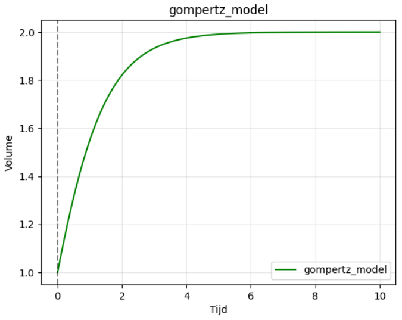

# Het modelleren van tumoren met behulp van ODE's: 


## Gebruik van de tumorODE klasse:

Importeer het script met `from tumor_ODE import tumorODE` en instantieer een tumor model:
`testTumor = tumorODE(volume,delta_t, n)` waarbij volume het startvolume van de tumor is, delta_t de grootte van de tijdsstap en n het aantal tijdstappen dat gamaakt moet worden. 
Deze instantie beschikt nu over verschillende methoden die gebruikt kunnen worden om de tumor te moddeleren, een volledig overzicht is hieronder gegeven bij "Gebruikte wiskundige modellen en toelichtingen"
Elk model heeft zijn eigen parameters die meegegeven moeten worden, de formule van elk model staat ook in de docstring van de functie beschreven. 
Voorbeeld:

```
testTumor = tumorODE(1,0.1, 100)

Ts,Vs = testTumor.gompertz_model(1,2)
testTumor.plot(Ts=Ts,Vs=Vs, color="green", label="gompertz_model")
testTumor.show_plot("gompertz_model")

```
In het bovenstaande voorbeeld wordt gebruik gemaakt van een gompertz model met c=1 en v_max = 2, vervolgens worden de verkregen Ts en Vs (tijdspunten en bijbehorende volumes) geplot met de .plot() methode, deze accepteert ook een kleur voor de grafiek en een label.
Er zijn meerdere lijnen van verschillende moddelen in de zelfde grafiek te plaatsen en met de .show_plot() methode worden deze in het zelfde venster met bijbehorende legenda weergeven. Dit zal er uitzien zoals op de onderstaande afbeelding.




## Biologische achtergrond (Tumorgroei)

Tumorgroei beschrijft de toename van het volume of aantal cellen van een tumor
in de tijd. In vroege groeifasen kan deze groei vaak snel en vrijwel onbeperkt
verlopen, terwijl in latere stadia beperkingen optreden door factoren zoals
voedsel- en zuurstofvoorziening, afvoer van afvalstoffen en beschikbare ruimte.

Om deze processen te beschrijven worden wiskundige modellen gebruikt, meestal
in de vorm van gewone differentiaalvergelijkingen (ODE’s). Afhankelijk van de
veronderstellingen over celproliferatie (het proces waarbij cellen zich vermenigvuldigen door middel van celdeling) 
en omgevingsbeperkingen ontstaan verschillende tumorgroeimodellen. Deze modellen worden veel toegepast om tumorgedrag 
te analyseren, parameters te schatten en experimentele data te vergelijken met theorie. Dit wordt dan ook gedaan in dit
project.

## Gebruikte wiskundige modellen en toelichting
De groei van tumoren kan worden beschreven door middel van differentiaalvergelijkingen: de verandering in het volume 
($V$) van een tumor over de tijd ($t$) is een functie van het huidige volume van de tumor. $$
\frac{dV}{dt} = f(V)
$$
Hoewel het volume varieert over de tijd, $V(t)$, hangt de functie $f$ zelf niet expliciet af van de tijd. Het model is
tijd-invariant (d.w.z. het gedrag van de groei van een tumor hangt niet af van het moment waarop 
hij begonnen is te groeien). Afhankelijk van de keuze en aannames rond de functie $f$ kunnen verschillende modellen 
worden verkregen. Zoals onderstaande modellen.

### **lineair model:** 
$$
\frac{dV}{dt} = c
$$
Een lineaire groeifunctie beschrijft een hoeveelheid die met een constante snelheid in de loop van de tijd toeneemt 
of afneemt.
In dit model is de groeisnelheid $c$ constant en onafhankelijk van het volume $V$. 
  
**Toepassing bij tumorgroei:**  
In het geval van tumorgroei 
kun je zeggen dat het lineaire model tumorgroei met een constante groeisnelheid, onafhankelijk van de tumorgrootte 
beschrijft.  

**Voordelen/pluspunten:**
- Simpel en intuïtief model.  
- Makkelijk te analyseren en te kalibreren.  

**Beperkingen:**  
- Houd geen rekening met afvlakking van groei bij grotere tumoren.  
- Negeert beïnvloeding van de groeisnelheid door bijvoorbeeld voedingsstoffen of ruimte.


### **exponentiëel model:** 
$$
\frac{dV}{dt} = c \cdot V
$$
Een exponentiële groeifunctie beschrijft een groei waarbij de snelheid evenredig is met het huidige volume; hoe groter de tumor wordt, des te sneller hij groeit. 
De groeisnelheid $c$ neemt dus toe met toenemend volume $V$.

**Toepassing bij tumorgroei:**
In het geval bij tumorgroei kun je zeggen dat het exponentiële model een tumor beschrijft die groeit met 
een snelheid die evenredig is aan zijn volume.
Geschikt voor kleine tumoren in vroege stadia waarbij de remmende factoren minimaal zijn.

**Voordelen/pluspunten:**
- goed voor snelle groei
- analytisch eenvoudig oplosbaar

**Beperkingen:**  
- Groei is onbeperkt, dit is biologisch vaak onrealistisch.


### **Mendelsohn model**
$$
\frac{dV}{dt} = c \cdot V^d
$$
Een Mendelsohn model generaliseert exponentiële groei door een exponent $d$ toe te voegen. De waarde van deze exponent, 
 $d$, is vaak gerelateerd aan de geometrie van de groei en kan verschillende waarden aannemen, afhankelijk van het 
specifieke model of de fase van tumorgroei. Dit model stelt dat de groeisnelheid evenredig is met het volume tot een bepaalde macht, wat vaak resulteert in een groei die sneller is dan lineair, maar trager is dan exponentieel.

**Toepassing bij tumorgroei:**
kan de snelheid van tumorgroei realistisch aanpassen afhankelijk van de tumoromstandigheden.

**Voordelen/pluspunten:**
- Flexibel model dat groei kan vertragen $d$<1 of versnellen $d$>1

**Beperkingen:**
- Extra parameter maakt calibratie complexer.

### **exponentieel afvlakkend model** 
$$
\frac{dV}{dt} = c \cdot (V_{\max} - V)
$$
Bij het exponentieel afvlakkend model vertraagt de groei naarmate het volume dichter bij $V_{\max}$ komt. Bij dit model is de groeisnelheid evenredig met de resterende ruimte tot het maximum, de groei is in het begin het snelst en neemt continu af naarmate het volume het limiet nadert.

**Toepassing bij tumorgroei:**
Geschikt om verzadiging en limieten in tumorvolume te modelleren. 

**Voordelen/pluspunten:**
- Simpele manier om afvlakking in te bouwen

**Beperkingen:**  
- Vereist kennis van het maximale volume  $V_{\max}$

### **logistisch model**
$$
\frac{dV}{dt} = c \cdot V \cdot (V_{\max} - V)
$$
Beschrijft snelle initiële groei die afvlakt naarmate het volume $V_{\max}$ nadert. 

**Toepassing bij tumorgroei:** 
veel gebruikt om tumoren te modelleren die een draagcapaciteit hebben. Dit model beschrijft een S-curve: de tumor groeit initieel exponentieel, maar vertraagt lineair naarmate het volume de maximale hoeveelheid nadert door beperkte ruimte of voedingsstoffen.   

**Voordelen / pluspunten:**  
- Realistisch initieel exponentiële groei gevolgd door afvlakking.  

**Beperkingen:**  
- Vereist kennis van het maximale volume $V_{\max}$.  

## **Montroll model**
$$
\frac{dV}{dt} = c \cdot V \cdot (V_{\max}^d - V^d)
$$
Breidt het logistische model uit met een exponent $d$ voor flexibeler afvlakgedrag. Dit is een algemene vorm van het logistische en Gompertz-model, waarbij een extra parameter wordt toegevoegd om de vorm van de curve en het punt waarop de vertraging optreedt flexibeler te beschrijven.  

**Toepassing bij tumorgroei:** 
geschikt wanneer het afvlakken van groei niet lineair verloopt.  

**Voordelen / pluspunten:**  
- Realistischer afvlakgedrag dan standaard logistisch model.  

**Beperkingen:**  
- Extra parameter $d$ maakt modelcomplexiteit groter.


### **Allee-effect model**
$$
\frac{dV}{dt} = c \cdot (V - V_{\min}) \cdot (V_{\max} - V)
$$
De groei bij dit model start pas boven een minimumvolume $V_{\min}$. Ook houdt dit model rekening met een 
drempelwaarde. 
 
**Toepassing bij tumorgroei:** 
nuttig voor tumoren die pas effectief groeien na een kritieke grootte. Als de tumorpopulatie te klein is, is de 
groeisnelheid negatief of nul (de tumor sterft uit) en groei treedt pas op zodra het volume boven deze minimale 
overlevingsgrens komt.  

**Voordelen / pluspunten:**  
- Beschrijft minimum effectieve tumoromvang.  

**Beperkingen:**  
- Vereist parameter $V_{\min}$ en $V_{\max}$.   


### **lineair gelimiteerd model**
$$
\frac{dV}{dt} = \frac{c \cdot V}{V + d}
$$
De groeisnelheid neemt af bij grotere volumes door de limiet $d$.  

**Toepassing bij tumorgroei:** 
geschikt voor tumoren met beperkte groeicapaciteit door ruimte of voedingsstoffen. Dit model beschrijft vaak tumoren 
waarvan de groeisnelheid begrensd wordt tot een constant maximum zodra de tumor een bepaalde grootte heeft bereikt. 

**Voordelen / pluspunten:**  
- Simpele afvlakking ingebouwd.  

**Beperkingen:**  
- Parameter $d$ nodig. 

### **oppervlakte-gelimiteerd model**
$$
\frac{dV}{dt} = \frac{c \cdot V}{(V + d)^{1/3}}
$$
De groei wordt beperkt door het oppervlak (bijvoorbeeld door diffusie van voeding).  

**Toepassing bij tumorgroei:** 
beschrijft fysiek gelimiteerde groei, realistisch voor grotere tumoren. Bij dit model groeien alleen de cellen aan de 
buitenrand van de tumor waardoor de groeisnelheid evenredig is met de oppervlakte in plaats van het totale volume.
 
**Voordelen / pluspunten:**  
- Houdt rekening met diffusielimieten.  

**Beperkingen:**  
- Parameter $d$ nodig.  

### **Von Bertalanffy model**
$$
\frac{dV}{dt} = c \cdot V^{2/3} - d \cdot V
$$
Metabolische verliezen verminderen de groeisnelheid naarmate het volume toeneemt.  

**Toepassing bij tumorgroei:** 
veel gebruikt in biologische groei-analyse. Dit model wordt ook gebruikt om de groei van individuele organismen te beschrijven.  

**Voordelen / pluspunten:**  
- Afvlakking door metabolisme meegenomen.  

**Beperkingen:**  
- Vereist parameters $c$ en $d$.

### **Gompertz model**
$$
\frac{dV}{dt} = c \cdot V \cdot \ln\left(\frac{V_{\max}}{V}\right)
$$
Initieel exponentiële groei die afvlakt richting $V_{\max}$. Vergelijkbaar met logistische groei, maar de afname van de specifieke groeisnelheid verloopt exponentieel.  

**Toepassing bij tumorgroei:** 
vaak gebruikt voor menselijke tumoren, realistisch verloop van initiële snelle groei tot verzadiging.  

**Voordelen / pluspunten:**  
- Realistisch voor veel biologische tumoren.  
- Beschrijft initieel snelle groei gevolgd door afvlakking.  

**Beperkingen:**  
- Vereist parameter $V_{\max}$. 

## Numerieke integratiemethoden

De groeimodellen (in het kopje "Gebruikte wiskundige modellen en toelichting") kunnen in de meeste gevallen niet 
analytisch (exact) worden opgelost. Daarom worden numerieke integratiemethoden gebruikt. Een groot voordeel van numerieke
wiskunde is dat een numeriek antwoord verkregen kan worden voor problemen, die geen "analytische" oplossing hebben. Er 
wordt vaak gebruik gemaakt van een visualizatie om inzicht in het gedrag van de oplossing te verkrijgen. Het maken van
bijvoorbeeld een grafiek met een numerieke methode is meestal efficiënter dan het evalueren van de analytische oplossing
in een groot aantal punten. Veel differentiaalvergelijkingen (zoals de modellen hierboven), die gebruikt worden om 
tumorgroei te simuleren, kunnen niet eenvoudig analytisch (exact) worden opgelost. De methode van Euler, Heun en
Runga-Kutta 4 maken het mogelijk om toch een goed inzicht te krijgen in het verloop van de oplossing door deze numeriek
te benaderen. Hier gaan we het hebben over deze 3 numerieke integratiemethoden hebben.

### **Euler-methode**
De Euler-methode is een eenvoudige numerieke techniek voor het benaderen van oplossingen van gewone 
differentiaalvergelijkingen (ODE’s). De methode levert geen exacte oplossing, maar een discrete benadering van de 
oplossing in opeenvolgende tijdstappen.  

De methode is gebaseerd op lineaire benadering: vanuit een bekend punt wordt met de lokale
helling (afgeleide) een korte stap gemaakt langs de raaklijn om het volgende punt te
schatten.

De Euler-methode is een eerste-orde methode en daardoor relatief onnauwkeurig, vooral bij
grotere tijdstappen, wel is het makkelijk te implementeren en te begrijpen. In dit project wordt de Euler-methode 
voornamelijk gebruikt ter vergelijking met nauwkeurigere methoden zoals Heun en Runge–Kutta van vierde orde (RK4).

### **Heun-methode**

De Heun-methode is een verbeterde numerieke integratiemethode voor gewone
differentiaalvergelijkingen (ODE's) en wordt ook wel gezien als een verfijning van de
Euler-methode. In plaats van alleen de helling aan het begin van een tijdstap
te gebruiken, wordt zowel de helling aan het begin als aan het einde van de
tijdstap meegenomen.

Door het gemiddelde van deze twee hellingen te gebruiken, ontstaat een betere
benadering van het verloop van de oplossing binnen één tijdstap. De Heun-methode
is een tweede-orde methode en biedt daardoor een duidelijk hogere nauwkeurigheid
dan de standaard Euler-methode, terwijl de rekentijd relatief beperkt blijft.


### **Runge–Kutta methode (RK4)**

De Runge–Kutta methode van vierde orde (RK4) is een veelgebruikte numerieke
integratiemethode voor het oplossen van gewone differentiaalvergelijkingen.
Per tijdstap worden meerdere hellingen berekend op verschillende punten binnen
de stap, die samen een nauwkeurige schatting van de oplossing opleveren.

Door deze combinatie van tussenstappen bereikt RK4 een hoge nauwkeurigheid en
stabiliteit. Het is een vierde-orde methode en daarom aanzienlijk nauwkeuriger
dan Euler- en Heun-methoden bij vergelijkbare tijdstappen. In dit project wordt
RK4 standaard gebruikt voor simulaties waarbij nauwkeurigheid van belang is.

## Mean Squared Error (MSE)

De Mean Squared Error (MSE) is een maat voor hoe goed een model past bij experimentele data. 
Het wordt berekend door het gemiddelde te nemen van de kwadraten van de verschillen 
tussen de voorspelde waarden van het model en de gemeten datapunten:

- Hoe kleiner de MSE, hoe beter het model de data beschrijft.  
- Het kwadrateren van de fouten legt extra gewicht op grotere afwijkingen, waardoor grote fouten sterker worden bestraft.  

In dit project wordt MSE gebruikt om tumorgroeimodellen te vergelijken en de 
optimale parameters te vinden die het model het beste laten overeenkomen met 
de experimentele meetwaarden.

## Hooke & Jeeves/direct search optimalisatie

De Hooke & Jeeves-methode is een numerieke optimalisatietechniek die wordt gebruikt 
om parameters van een model te vinden die een bepaalde doelwaarde minimaliseren of 
maximaliseren, bijvoorbeeld de MSE tussen model en experimentele data. Voor dit project wil je de optimale waarden van 
de parameters vinden voor je model die het beste resultaat geven tussen je model en je data. Je wilt dus dat de MSE 
zo klein mogelijk is. Om de beste parameterwaarden te vinden gebruik je de Hooke & Jeeves/direct search optimalisatie.

- Het is een zogenaamde direct search-methode, wat betekent dat er geen 
  analytische afgeleiden nodig zijn van de functie die geoptimaliseerd wordt.  
- De methode werkt door iteratief kleine stappen omhoog of omlaag te proberen in 
  de parameters, en zo het minimum van de foutfunctie te benaderen.  
- Bij elke iteratie worden de stapgroottes aangepast afhankelijk van of de 
  verandering de fout verbetert of niet.  

In dit project wordt Hooke & Jeeves gebruikt om de optimale parameters van de 
tumorgroeimodellen te bepalen zodat het model zo goed mogelijk overeenkomt met 
de experimentele data.

## Modelselectie: AIC, AICc en BIC (informatie criteria) ##

Om verschillende tumorgroeimodellen te vergelijken en te beoordelen welk model 
het beste bij de data past, gebruiken we informatiecriteria AIC, AICc en BIC.  

### **AIC (Akaike Information Criterion)**
$$ AIC = n * ln(MSE) + 2k$$
Hierin is $n$ het aantal datapunten waarvoor de fit gemaakt wordt, en $k$ het aantal parameters in het model.

Het Akaike Informatie Criteria is een maat die zowel de nauwkeurigheid van het model als het aantal parameters in 
rekening brengt. Lagere AIC-waarden wijzen op een beter compromis tussen fit en complexiteit.

### **AICc (corrected Akaike Information Criterian)** 
$$ AICc = n * ln(MSE) + \frac {2k *n} {n-k-1}$$
Hierin is $n$ het aantal datapunten waarvoor de fit gemaakt wordt, en $k$ het aantal parameters in het model.

Het Akaike Inforamtie Criteria coreccted is een aangepaste versie van AIC voor kleine datasets. 
Deze correctie voorkomt dat modellen met veel parameters onterecht de voorkeur krijgen bij weinig datapunten.

### **BIC (Bayesian Information Criterion)** 
$$ BIC = n * ln(MSE) + ln(n) * k$$ 
Hierin is $n$ het aantal datapunten waarvoor de fit gemaakt wordt, en $k$ het aantal parameters in het model.

Het Bayesian Informatie Criteria is vergelijkbaar met AIC, maar straft complexe modellen sterker af naarmate het 
aantal datapunten groter is.

In dit project helpen deze criteria om objectief te bepalen welk tumorgroeimodel 
het meest geschikt is voor de beschikbare data, naast het beoordelen via MSE.

Let wel op, de AIC-, AICc- en BIC-scores 
zeggen op zichzelf staand niks. Het zijn relatieve maatstaven. Ze geven pas betekenis als je meerdere modellen met elkaar
vergelijkt. Je moet dus de scores van verschillende modellen met elkaar vergelijken om iets te kunnen
zeggen over de geschiktheid van de modellen. Een lage AIC/AICc/BIC betekent beter compromis tussen fit en complexiteit,
maar alleen ten opzichte van andere modellen. Je kunt dus niet zeggen “dit model is goed” op basis van één score; 
je moet altijd verschillen tussen modellen bekijken.

###  Gebruikte data ###

V79-cellen (afkomstig van Chinese hamster longfibroblasten) worden veel gebruikt
in onderzoek naar DNA-schade en DNA-reparatie. Belangrijk is echter dat deze
cellijn mutaties bevat in het p53-gen, een sleutelgen in de cellulaire respons
op DNA-schade en apoptose.

Onderzoek heeft aangetoond dat het p53-eiwit in V79-cellen gemuteerd en
functioneel inactief is, in tegenstelling tot primair Chinees hamster
embryonaal fibroblast (CHEF) cellen. Dit betekent dat resultaten met betrekking
tot DNA-schade, reparatie en geprogrammeerde celdood in V79-cellen met
voorzichtigheid moeten worden geïnterpreteerd.
De data die als voorbeeld gebruikt is voor dit project is afkomstig Lee, J. M., Bernstein, A., & el-Deiry, W. S. (1994).
p53 in Chinese hamster V79 cells is nonfunctional due to mutation [3].


### Bronnen: ###
1. Treatment Optimization for Tumor Growth by Ordinary Differential Equations
2. Euler's Method: https://tutorial.math.lamar.edu/classes/de/eulersmethod.aspx
3. Hamster cellen: https://pmc.ncbi.nlm.nih.gov/articles/PMC146528/
4. Groeimodellen: https://cdn.hackaday.io/files/8586367343424/From%20the%20Mendelsohn%20model%20to%20the%20Gompertz%20and%20logistic%20growth%20law.pdf
5. Groeimodellen: https://ascpt.onlinelibrary.wiley.com/doi/10.1002/psp4.12450
6. Groeimodellen: https://set.kuleuven.be/voorkennis/blik-op-wiskunde/handboekB/explog/groeimodellen
7. Groeimodellen: https://cdn.hackaday.io/files/8586367343424/From%20the%20Mendelsohn%20model%20to%20the%20Gompertz%20and%20logistic%20growth%20law.pdf
8. Groeimodellen: https://www.sciencedirect.com/science/article/abs/pii/S0734975024000296
9. Numerieke integratiemethoden: https://www.researchgate.net/profile/Jos-Van-Kan-2/publication/267301500_Numerieke_Methoden_voor_Differentiaalvergelijkingen/links/54621fe20cf2b3b32049a5fd/Numerieke-Methoden-voor-Differentiaalvergelijkingen.pdf
10. Numerieke integratiemethoden: https://www.albert.io/blog/eulers-method-and-approximating-solutions-ap-calculus-ab-bc-review/#:~:text=Euler's%20Method%20starts%20with%20a,reaching%20the%20region%20of%20interest.
11. Numerieke integratiemethoden: https://franciscorichter.github.io/files/ode-2025/lecture07.pdf?utm_source=chatgpt.com
12. Numerieke integratiemethoden: https://andre-massing.github.io/TMA4320_ScientificComputationNotes/chapter_ode/RungeKuttaNuMeODE.html?utm_source=chatgpt.com
13. MSE: https://www.britannica.com/science/mean-squared-error
14. Hooke & Jeeves/direct search optimalisatie: https://web.stanford.edu/group/sisl/k12/optimization/MO-unit2-pdfs/2.11minimum3D2hooke-jeeves.pdf
15. Hooke & Jeeves/direct search optimalisatie: https://deepgram.com/ai-glossary/hooke-jeeves-algorithm
16. Modelselectie: https://www.math.ru.nl/~landsman/scriptieMT.pdf
17. Modelselectie: https://www.sciencedirect.com/science/article/abs/pii/S0167947313002776#:~:text=Despite%20their%20broad%20use%20in,to%20select%20the%20simplest%20model.
